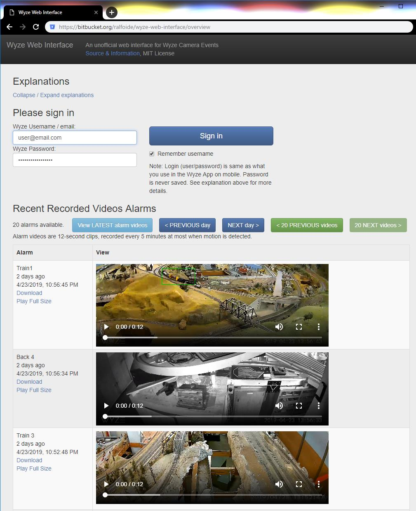

# Wyze Web Interface

**Wyze Web Interface is an unofficial _Wyze Camera_ web client interface**.

This is a little _demonstration_ web client that displays the most recent alarm videos of Wyze cameras.

>This project is not affiliated nor endorsed by Wyze Labs, Inc. The Wyze name and all related logos are most likely trademarks of Wyze Labs, Inc. or its affiliates.

## Usage

1. Clone directory or copy the content of the [`web`](https://bitbucket.org/ralfoide/wyze-web-interface/src/HEAD/web/) folder locally.
2. Use your web browser to navigate to your local copy of [`web/wyzeweb.html`](https://bitbucket.org/ralfoide/wyze-web-interface/src/HEAD/web/wyzeweb.html). Using a `file://` reference works. No web server is required.
3. Enter your Wyze account login information.
4. Using the Wyze API:
    * The cameras registered with the account are displayed,
    * The last 20 alarm videos are listed and playable in browser.

>**Important**: There is no server-side component in this little demonstration project. All the connection happens in your own web browser (including Wyze authentication).

## Limitations

_The Wyze API is not official_. It can change at any moment, for example due to Wyze servers updates or hardware/firmware updates.

The following features are not supported nor implemented:

* Account management: user registration, change name, change password.
* Device management: registering, unregistering, sharing camera or other device.
* Automation and Actions.
* Filtering alarm notifications by date or camera.
* Timezone management (all dates are considered as being within the local browser timezone).
* Live view from cameras.

>**Note**: The first few features are trivial to support.
The last one, live view, would be harder due to the lack of native RTP/RTSP support in web browsers.

Browser requirements:

* EcmaScript 6 features.
* `<video>` mp4 support.

Any recent version of Chrome or Firefox should work just fine.

## Screenshot

## License

MIT license. See [LICENSE.txt](https://bitbucket.org/ralfoide/wyze-web-interface/src/HEAD/LICENSE.txt).

~~
